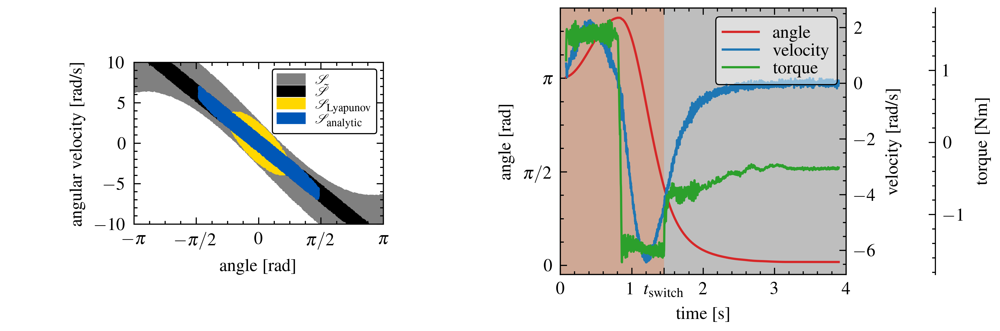

## Abstract
Linear-quadratic regulators (LQR) are a well known and widely used tool in control theory for both linear and nonlinear dynamics. For nonlinear problems, an LQR-based controller is usually only locally viable, thus, raising the problem of estimating the region of attraction (ROA). The need for good ROA estimations becomes especially pressing for underactuated systems, as a failure of controls might lead to unsafe and unrecoverable system states. Known approaches based on optimization or sampling, while working well, might be too slow in time critical applications and are hard to verify formally. In this work, we propose a novel approach to estimate the ROA based on the analytic solutions to linear ODEs for the torque limited simple pendulum. In simulation and physical experiments, we compared our approach to a Lyapunov-sampling baseline approach and found that our approach was faster to compute, while yielding ROA estimations of similar phase space area.

{height=200}

## Technique
The system we consider is a simple pendulum stabilized in the upright position by an LQR-controller, in addition we impose torque limits on the motor. For this system, we analytically derive an approximation of the ROA based on the assumption, that the LQR controller performs well within the torque limits, but we distrust the controller once it demands torques above the limit. We compare our method to a sampling based approach numerically and on a physical system. In addition, we implemented a switching behaviour between an energy-shaping- and an LQR-controller based on our ROA estimation and run tests on the physical system. For an in-depth description, refer to the [technical paper](https://arxiv.org/abs/2211.15437).

## Results
We find that our method, compared to the chosen baseline, performs similar in terms of phase-space volume (see left side of figure). However, our method showed to be orders of magnitude faster to compute. The average time it took to reinitialize each method for a new set of parameters are
$$
T_{analytic} = 0.00136s \qquad T_{baseline} = 12.8s.
$$
The implemented swing-up controller managed to successfully swing-up and stabilize the pendulum in the upright position (see right side of figure). Therefore, our method performed as expected and estimated the system to be within the ROA at time $T_{switch}$ correctly. Again, for an extensive discussion of the results, refer to the [technical paper](https://arxiv.org/abs/2211.15437).

{height=200}

## Citation
```
@INPROCEEDINGS{2022_Gross_analytic_roa_cdc,
  author={Gross, Lukas and Maywald, Lasse and Kumar, Shivesh and Kirchner, Frank and Lüth, Christoph},
  booktitle={2022 61st IEEE Conference on Decision and Control (CDC)}, 
  title={Analytic Estimation of Region of Attraction of an LQR Controller for Torque Limited Simple Pendulum}, 
  year={2022},
  volume={},
  number={},
  pages={},
  doi={}}
```

